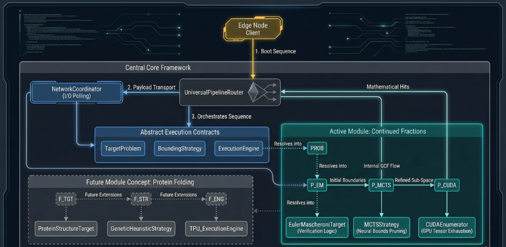

# Ramanujan Engine: Universal Distributed Scientific Computing Framework

[](https://opensource.org/licenses/MIT)
[](https://www.python.org/downloads/release/python-3130/)
[](https://pytorch.org/)
[](https://firebase.google.com/)

A globally distributed, GPU-accelerated computing framework that orchestrates **Deep Reinforcement Learning** with **PyTorch Tensor exhaustion** to solve arbitrary scientific problems at scale. Continued Fractions discovery is just one of many pluggable modules — the framework generalizes to any problem domain.

---

## 🌟 Key Modifications

| Feature | Description |
|---|---|
| **Universal Pipeline Router** | A 4-stage abstract execution engine (`core/pipeline.py`) that decouples problem definition, search strategy, compute engine, and network coordination into fully interchangeable plugins. |
| **Deep RL Bounds Pruning** | AlphaTensor MCTS heuristic (`modules/continued_fractions/math_ai/`) intelligently slices coordinate spaces before GPU exhaustion. |
| **LLL/PSLQ Identity Resolver** | Automatic algebraic identity detection on every GPU hit — turns raw numerical matches into provable closed-form expressions using lattice basis reduction. |
| **Modular Problem System** | Scientific problems are self-contained modules under `modules/`. Adding a new problem domain requires zero modifications to the core framework. |
| **Problem-Namespaced Database** | Firebase paths auto-namespace under `/problems/{name}/` — multiple scientific problems can run on the same cluster simultaneously. |
| **Compute Telemetry** | Per-node and per-problem atomic counters track total GPU hours, combinations evaluated, and contributor attribution. |
| **Zero-Loss Edge Caching** | Hardened `sqlite3` local cache with generic schema guarantees verified discoveries survive power/network failures. |
| **1-Click Deployment** | Windows volunteers join the cluster by double-clicking `run_node.bat` — handles Python isolation, dependencies, and credential generation automatically. |
| **Research RL Training Suite** | Dedicated Curriculum Learning PPO pipeline with TensorBoard MLOps at `research_training/`. |

---

## 🏗️ Architecture & Hierarchy

The framework is built on a strict separation between **core infrastructure** and **scientific modules**. The `UniversalPipelineRouter` orchestrates any combination of plugins without knowing their internals.



### Abstract Interfaces (`core/interfaces/`)

| Interface | File | Purpose |
|---|---|---|
| `TargetProblem` | `base_problem.py` | Defines the mathematical/scientific problem — constants, verification logic, LHS hash generation |
| `BoundingStrategy` | `base_strategy.py` | Search space optimization — AI pruning, heuristics, or brute-force passthrough |
| `ExecutionEngine` | `base_engine.py` | Hardware-accelerated compute — CUDA tensors, CPU multiprocessing, TPU, etc. |
| `NetworkCoordinator` | `base_coordinator.py` | Distributed coordination — work unit fetching, result submission, authentication |

### Adding a New Scientific Module

To add a new problem domain (e.g. `protein_folding`):

```python
# modules/protein_folding/target.py
from core.interfaces.base_problem import TargetProblem

class ProteinFoldingTarget(TargetProblem):
    @property
    def name(self): return "protein-folding"

    def verify_match(self, a_coef, b_coef):
        # Your domain-specific verification
        ...
```

No changes to `core/` are required. The pipeline automatically routes through your new plugin.

---

## 🗃️ Available Modules

| Module | Directory | Status | Description |
|---|---|---|---|
| **Continued Fractions** | `modules/continued_fractions/` | ✅ Active | GPU-accelerated discovery of novel GCF formulas for mathematical constants (Euler-Mascheroni, Zeta, Catalan, etc.) |
| **RL Training Suite** | `research_training/` | ✅ Active | Curriculum PPO training for the AlphaTensor MCTS neural bounds pruner |

*Future modules can be added by implementing the 4 core interfaces — see Architecture section above.*

---

## 🚀 Execution Guide

### 1-Click Deployment (Windows Volunteers)
```bash
git clone https://github.com/meural-operator/ramanujan_engineV2.git
cd ramanujan_engineV2/clients
# Double-click run_node.bat — or from terminal:
.\run_node.bat
```
> The script auto-installs Python 3.13 via Micromamba, bootstraps all dependencies, generates Firebase credentials, seeds the LHS math tables, and launches the GPU compute node.

### Manual Research Setup
```bash
# 1. Create conda environment
conda env create -f setup/environment.yml
conda activate curiosity

# 2. Seed mathematical verification tables (one-time, ~10s)
python scripts/seed_euler_mascheroni_db.py

# 3. Launch the edge compute node
cd clients
python edge_node.py
```

### RL Neural Network Training
```bash
cd research_training
python train.py --episodes 50000 --max-depth 200

# Monitor training metrics
tensorboard --logdir runs/
```

### Running Tests
```bash
python -m unittest discover -s tests -v
```

---

## 📁 Directory Structure

> ✅ = Currently implemented &nbsp;&nbsp; 🔮 = Planned / Future extension

```
ramanujan_engineV2/
│
├── core/                                        # ✅ Universal Framework Engine (problem-agnostic)
│   ├── __init__.py
│   ├── pipeline.py                              #    UniversalPipelineRouter — 4-stage orchestrator
│   ├── interfaces/                              #    Abstract Base Classes (contracts)
│   │   ├── base_problem.py                      #    TargetProblem — defines what to solve
│   │   ├── base_strategy.py                     #    BoundingStrategy — how to prune search space
│   │   ├── base_engine.py                       #    ExecutionEngine — hardware compute backend
│   │   └── base_coordinator.py                  #    NetworkCoordinator — distributed I/O
│   └── coordinators/                            #    Network implementations
│       └── firebase_coordinator.py              #    Firebase REST API coordinator
│
├── modules/                                     # ✅ Scientific Problem Modules
│   └── continued_fractions/                     # ✅ Generalized Continued Fraction Discovery
│       ├── constants.py                         #    g_const_dict — all mathematical constants
│       ├── LHSHashTable.py                      #    Precomputed Möbius transform lookup
│       ├── CachedSeries.py                      #    Cached polynomial series evaluator
│       ├── multiprocess_enumeration.py          #    CPU multiprocess coordinator
│       │
│       ├── targets/                             #    Target constant plugins
│       │   └── euler_mascheroni.py              #    ✅ Euler-Mascheroni (γ = 0.5772...)
│       │
│       ├── engines/                             #    GPU/CPU enumeration backends
│       │   ├── AbstractGCFEnumerator.py         #    Base enumerator with shared logic
│       │   ├── EfficientGCFEnumerator.py        #    ✅ CPU vectorized enumerator
│       │   ├── GPUEfficientGCFEnumerator.py     #    ✅ CUDA tensor broadcast enumerator
│       │   ├── FREnumerator.py                  #    ✅ Multi-dimensional PSLQ enumerator
│       │   ├── ParallelGCFEnumerator.py         #    ✅ ProcessPool parallel enumerator
│       │   ├── RelativeGCFEnumerator.py         #    ✅ Relative convergence enumerator
│       │   └── cuda_gcf.py                      #    ✅ V4 CUDAEnumerator adapter wrapper
│       │
│       ├── domains/                             #    Polynomial search space definitions
│       │   ├── AbstractPolyDomains.py           #    Base domain interface
│       │   ├── CartesianProductPolyDomain.py    #    ✅ Full Cartesian product generator
│       │   ├── ExplicitCartesianProductPolyDomain.py
│       │   ├── MCTSPolyDomain.py                #    ✅ MCTS-guided search domain
│       │   ├── NeuralMCTSPolyDomain.py          #    ✅ Neural network guided domain
│       │   ├── ContinuousRelaxationDomain.py    #    ✅ Continuous relaxation optimizer
│       │   ├── CatalanDomain.py                 #    ✅ Catalan constant domain
│       │   ├── Zeta3Domain1.py                  #    ✅ ζ(3) Apéry-style domain
│       │   ├── Zeta3Domain2.py                  #    ✅ ζ(3) alternate structure
│       │   ├── Zeta3DomainWithRatC.py           #    ✅ ζ(3) with rational coefficients
│       │   ├── Zeta5Domain.py                   #    ✅ ζ(5) multi-dim domain
│       │   ├── Zeta7Domain.py                   #    ✅ ζ(7) domain
│       │   └── ExamplePolyDomain.py             #    Template for new domains
│       │
│       ├── math_ai/                             #    Deep RL and symbolic AI
│       │   ├── symbolic_regression.py           #    Symbolic regression utilities
│       │   ├── models/                          #    Neural network architectures
│       │   │   └── actor_critic.py              #    ✅ Actor-Critic policy network
│       │   ├── agents/                          #    RL agent implementations
│       │   │   └── alpha_tensor_mcts.py         #    ✅ AlphaTensor MCTS agent (12.9 KB)
│       │   ├── environments/                    #    RL environment definitions
│       │   │   ├── AbstractRLEnvironment.py     #    Base RL environment
│       │   │   ├── EulerMascheroniEnvironment.py#    ✅ γ-specific reward environment
│       │   │   └── GCFRewardEnvironment.py      #    ✅ Generic GCF reward shaper
│       │   ├── training/                        #    Training infrastructure
│       │   │   ├── ppo_trainer.py               #    ✅ PPO training loop
│       │   │   ├── replay_buffer.py             #    ✅ Experience replay buffer
│       │   │   └── checkpoint.py                #    ✅ Model save/load utilities
│       │   └── strategies/                      #    Bounding strategy plugins
│       │       └── mcts_strategy.py             #    ✅ MCTSStrategy (BoundingStrategy impl)
│       │
│       └── utils/                               #    Mathematical utilities
│           ├── asymptotic_filter.py             #    ✅ Worpitzky convergence filter
│           ├── lll_identity_resolver.py         #    ✅ LLL/PSLQ algebraic identity resolver
│           ├── convergence_rate.py              #    ✅ Digits-per-term calculator
│           ├── mobius.py                        #    ✅ Möbius transformation engine (12 KB)
│           ├── latex.py                         #    LaTeX formula renderer
│           └── utils.py                         #    General math helpers
│
│   ├── protein_folding/                         # 🔮 Future: Protein structure prediction
│   ├── prime_gaps/                              # 🔮 Future: Prime gap analysis
│   └── symbolic_integration/                    # 🔮 Future: Symbolic integral discovery
│
├── clients/                                     # ✅ Distributed Edge Compute Nodes
│   ├── edge_node.py                             #    Universal client entrypoint
│   ├── run_node.bat                             #    1-click Windows deployer (Micromamba)
│   ├── firebase_config.json                     #    Auto-generated cloud credentials
│   ├── checkpoints/                             #    Compiled RL weight artifacts
│   │   └── em_mcts.pt                           #    ✅ Trained MCTS weights (3.6 MB)
│   └── setup/                                   #    Auto-installer scripts
│       ├── autoinstaller.py                     #    Dependency bootstrapper
│       ├── global_seeder.py                     #    Firebase work-unit seeder
│       └── genesis_wipe.py                      #    Database reset utility
│
├── research_training/                           # ✅ Dedicated RL Training Pipeline
│   ├── train.py                                 #    PPO curriculum trainer (10 KB)
│   ├── config.yaml                              #    Hyperparameter configuration
│   ├── env_curriculum.py                        #    Curriculum level progression
│   ├── eval_mcts.py                             #    MCTS inference visualizer
│   └── runs/                                    #    TensorBoard log directory
│
├── scripts/                                     # ✅ Utility & Research Scripts
│   ├── seed_euler_mascheroni_db.py              #    LHS hash table generator
│   ├── train_rl_em.py                           #    Standalone RL training script
│   ├── euler_mascheroni_ai_search.py            #    AI-guided search launcher
│   ├── euler_mascheroni_research_grade.py       #    Research-grade evaluation
│   ├── reset_v2_cursor.py                       #    Firebase cursor reset tool
│   ├── multiprocessing_example.py               #    CPU parallelism demo
│   ├── zeta3_fr_results.py                      #    ζ(3) result analysis
│   ├── zeta3_infinite_family.py                 #    ζ(3) infinite family searcher
│   ├── boinc/                                   #    BOINC distributed computing
│   │   ├── execute_from_json.py                 #    JSON work-unit executor
│   │   └── split_execution.py                   #    Work-unit splitter
│   └── paper_results/                           #    Published paper reproductions
│       ├── e_results.py                         #    Euler's number results
│       ├── pi_results.py                        #    π results
│       └── zeta3_results.py                     #    ζ(3) results
│
├── tests/                                       # ✅ Unit & Integration Tests
│   ├── test_interfaces.py                       #    Core ABC contract tests
│   ├── test_universal_pipeline.py               #    V4 pipeline integration tests
│   ├── test_lll_resolver.py                     #    LLL/PSLQ identity resolver tests (6/6)
│   ├── test_ai_modules.py                       #    Actor-Critic network tests
│   ├── test_asymptotic_filter.py                #    Worpitzky convergence tests
│   ├── test_gpu_enumerators.py                  #    GPU vs CPU parity tests
│   ├── test_fr_expansion.py                     #    Multi-dim PSLQ tests
│   ├── test_poly_domains.py                     #    Domain generator tests
│   ├── test_large_catalan.py                    #    Large Catalan constant tests
│   ├── conjectures_tests.py                     #    Known conjecture validations
│   └── boinc_scripts_tests.py                   #    BOINC integration tests
│
├── ESMA/                                        # ✅ Legacy reference implementation
├── README.md                                    #    This file
├── CHANGELOG.md                                 #    Version history
└── requirements.txt                             #    Python dependencies
```

---

## 🗄️ Database Architecture

The Firebase Realtime Database is **problem-namespaced** — multiple scientific problems run on the same cluster simultaneously without schema changes.

```
ramanujan-engine/
│
├── nodes/                              ← ONE entry per volunteer (no duplication)
│   └── {node_id}/
│       ├── hostname: "DIAT-Lab-01"
│       ├── gpu_model: "RTX 4000 Ada"
│       ├── os: "Windows 11"
│       ├── python_version: "3.13.0"
│       ├── last_heartbeat: 1711234999000
│       ├── total_units_completed: 4217
│       └── total_gpu_seconds: 89432.5
│
├── problems/                           ← Auto-namespaced per problem type
│   └── {problem_name}/                 (e.g., "euler-mascheroni")
│       ├── config/
│       │   └── status: "active"        ("active" | "solved" | "paused")
│       │
│       ├── tasks/
│       │   └── cursor/                 ← Atomic work assignment state
│       │       ├── current_a_pos
│       │       ├── current_b_pos
│       │       └── degree
│       │
│       ├── results/                    ← Verified discoveries
│       │   └── {push_id}/
│       │       ├── hit_key
│       │       ├── params              (JSON blob — problem-agnostic)
│       │       ├── identity            (closed-form if LLL found one)
│       │       ├── identity_method     ("pslq_basis" | "mpmath_identify")
│       │       ├── identity_residual
│       │       ├── node_id             ← FK to /nodes/ (no duplication)
│       │       └── ts
│       │
│       └── stats/                      ← Aggregated compute telemetry
│           ├── total_combinations_evaluated
│           └── total_gpu_hours
```

### Design Principles

| Principle | Implementation |
|---|---|
| **Zero Redundancy** | Node metadata (email, GPU, hostname) stored once in `/nodes/`. Results reference by `node_id` FK. |
| **Atomic Counters** | Compute telemetry uses read-modify-write increments, never per-result duplication. |
| **Problem Isolation** | Each problem type gets isolated `/tasks/`, `/results/`, `/stats/` — no cross-contamination. |
| **Discovery Attribution** | Every result links to the contributing node. Query "who solved it" is trivial. |
| **Lifecycle Control** | Set `/problems/{name}/config/status` to `"solved"` and all edge nodes gracefully stop. |

### Local SQLite Backup

The edge node maintains a local cache with a generic schema that works for any problem:

```sql
CREATE TABLE pending_hits (
    problem_type TEXT,    -- e.g., "euler-mascheroni"
    hit_key      TEXT,    -- constant-specific hash key
    params_json  TEXT,    -- JSON blob of all hit parameters
    node_id      TEXT,    -- this node's identifier
    ts           REAL     -- Unix timestamp
);
```

---

## 🤝 Contributing

1. Fork the repository
2. Create a feature branch: `git checkout -b feature/my-new-module`
3. Implement your scientific module under `modules/your_module/`
4. Add tests under `tests/`
5. Submit a Pull Request

For new problem domains, implement the 4 interfaces in `core/interfaces/` and register your module. The framework handles everything else — database namespacing, telemetry, and edge caching are fully automatic.

---

## 📄 License

This project is licensed under the MIT License.
